# Class Diagram — As-Built

Diagram ini disusun langsung dari nama class/interface/method nyata di `app/` (bukan karangan). Garis putus-putus (`..|>`) menandakan implementasi interface (Dependency Inversion); garis penuh (`-->`) menandakan dependency ke kelas konkret.

```mermaid
classDiagram
    %% ===== Core =====
    class Router { +get() +post() +put() +delete() +patch() +any() +dispatch(Request) -resolveArguments() }
    class Auth { +login() +check() +user() +hasRole() +requireLogin() +requireRole(roles...) +requireLoginApi() +requireRoleApi(roles...) }
    class Session { +start() +flash() +old() +setErrors() +getErrors() }
    class Database { +connection() PDO }
    class Request { +method() +path() +input() +jsonBody() +file() }
    class Response { +html() +json() +redirect() +csv() +notFound() +unauthorized() +forbidden() +serverError(path) }
    class View { +render() +display() }
    class Env { +load() +get() }

    %% ===== Entity =====
    class User
    class Product
    class ProductStock
    class Category
    class Supplier
    class Customer
    class Warehouse
    class PurchaseOrder
    class PurchaseOrderItem
    class SalesOrder
    class SalesOrderItem
    class StockLedger

    %% ===== Repository Interfaces =====
    class UserRepositoryInterface { <<interface>> }
    class ProductRepositoryInterface { <<interface>> }
    class ProductStockRepositoryInterface { <<interface>> +lockForUpdate(pdo,pid,wid) +increment() +decrement() +countLowStock() +lowStockList() }
    class CategoryRepositoryInterface { <<interface>> }
    class SupplierRepositoryInterface { <<interface>> }
    class CustomerRepositoryInterface { <<interface>> }
    class WarehouseRepositoryInterface { <<interface>> }
    class PurchaseOrderRepositoryInterface { <<interface>> }
    class SalesOrderRepositoryInterface { <<interface>> }
    class StockLedgerRepositoryInterface { <<interface>> }

    %% ===== Repository Implementations (MySQL) =====
    class MySqlUserRepository
    class MySqlProductRepository
    class MySqlProductStockRepository
    class MySqlCategoryRepository
    class MySqlSupplierRepository
    class MySqlCustomerRepository
    class MySqlWarehouseRepository
    class MySqlPurchaseOrderRepository
    class MySqlSalesOrderRepository
    class MySqlStockLedgerRepository
    class AbstractMySqlRepository { <<abstract>> #fetchRows() #fetchRow() #execute() #insert() #buildWhere() #searchRows() #countRows() #dateOrder() }

    %% ===== Repository Implementations (In-Memory, untuk unit test) =====
    class InMemoryUserRepository
    class InMemoryProductRepository
    class InMemoryProductStockRepository
    class InMemorySalesOrderRepository

    MySqlUserRepository ..|> UserRepositoryInterface
    InMemoryUserRepository ..|> UserRepositoryInterface
    MySqlProductRepository ..|> ProductRepositoryInterface
    InMemoryProductRepository ..|> ProductRepositoryInterface
    MySqlProductStockRepository ..|> ProductStockRepositoryInterface
    InMemoryProductStockRepository ..|> ProductStockRepositoryInterface
    MySqlCategoryRepository ..|> CategoryRepositoryInterface
    MySqlSupplierRepository ..|> SupplierRepositoryInterface
    MySqlCustomerRepository ..|> CustomerRepositoryInterface
    MySqlWarehouseRepository ..|> WarehouseRepositoryInterface
    MySqlPurchaseOrderRepository ..|> PurchaseOrderRepositoryInterface
    MySqlSalesOrderRepository ..|> SalesOrderRepositoryInterface
    InMemorySalesOrderRepository ..|> SalesOrderRepositoryInterface
    MySqlStockLedgerRepository ..|> StockLedgerRepositoryInterface
    MySqlPurchaseOrderRepository --|> AbstractMySqlRepository
    MySqlSalesOrderRepository --|> AbstractMySqlRepository
    MySqlStockLedgerRepository --|> AbstractMySqlRepository

    %% ===== Service =====
    class AuthService { +attempt(email,password) }
    class UserService { +create() +update() +deactivate() }
    class ProductService { +paginate() +create() +update() +delete() }
    class CategoryService
    class SupplierService
    class CustomerService
    class WarehouseService
    class PurchaseOrderService { +validateOrderDate() +create() +transitionTo() +receiveGoods() }
    class SalesOrderService { +create() +submitForApproval() +approve() +reject() +cancel() +fulfill() }
    class StockLedgerService { +search() }
    class DashboardService { +summaryFor(role,userId) }
    class ReportService { +stockLedgerCsv() +orderStatusCsv() }

    %% ===== Exception (domain) =====
    class ValidationException { +errors() }
    class InvalidStatusTransitionException { +make(from,to) }
    class InsufficientStockException { +forProduct(id,req,avail) }
    class AuthorizationException { +forbidden(msg) }

    SalesOrderService ..> ValidationException
    SalesOrderService ..> InvalidStatusTransitionException
    SalesOrderService ..> InsufficientStockException
    SalesOrderService ..> AuthorizationException
    PurchaseOrderService ..> ValidationException
    PurchaseOrderService ..> InvalidStatusTransitionException

    AuthService --> UserRepositoryInterface
    UserService --> UserRepositoryInterface
    ProductService --> ProductRepositoryInterface
    CategoryService --> CategoryRepositoryInterface
    SupplierService --> SupplierRepositoryInterface
    CustomerService --> CustomerRepositoryInterface
    WarehouseService --> WarehouseRepositoryInterface
    PurchaseOrderService --> PurchaseOrderRepositoryInterface
    PurchaseOrderService --> ProductStockRepositoryInterface
    PurchaseOrderService --> StockLedgerRepositoryInterface
    PurchaseOrderService --> Database : uses PDO
    SalesOrderService --> SalesOrderRepositoryInterface
    SalesOrderService --> ProductStockRepositoryInterface
    SalesOrderService --> StockLedgerRepositoryInterface
    SalesOrderService --> Database : uses PDO
    StockLedgerService --> StockLedgerRepositoryInterface
    ReportService --> StockLedgerRepositoryInterface
    ReportService --> PurchaseOrderRepositoryInterface
    ReportService --> SalesOrderRepositoryInterface

    %% ===== Controller =====
    class Controller { <<abstract>> #handle(action,isApi,fallbackUrl) #render() #redirect() #json() }
    class CrudController { <<abstract>> +index() +create() +store(Request) +edit(params) +update(Request,params) #remove(params) #service() }
    class AuthController
    class UserController
    class ProductController
    class CategoryController
    class SupplierController
    class CustomerController
    class WarehouseController
    class PurchaseOrderController
    class SalesOrderController
    class DashboardController
    class ReportController
    class ApiController { +productAvailability(params) }

    AuthController --|> Controller
    CrudController --|> Controller
    UserController --|> CrudController
    CategoryController --|> CrudController
    SupplierController --|> CrudController
    CustomerController --|> CrudController
    WarehouseController --|> CrudController
    ProductController --|> Controller
    PurchaseOrderController --|> Controller
    SalesOrderController --|> Controller
    DashboardController --|> Controller
    ReportController --|> Controller
    ApiController --|> Controller

    AuthController --> AuthService
    UserController --> UserService
    CategoryController --> CategoryService
    SupplierController --> SupplierService
    CustomerController --> CustomerService
    WarehouseController --> WarehouseService
    ProductController --> ProductService
    PurchaseOrderController --> PurchaseOrderService
    SalesOrderController --> SalesOrderService
    DashboardController --> DashboardService
    ReportController --> ReportService
    ApiController --> MySqlProductRepository
    ApiController --> MySqlProductStockRepository
    ApiController --> MySqlWarehouseRepository

    Router --> Auth
    Auth --> Session
```

## Perubahan dari draft awal, dan alasannya

1. **Implementasi In-Memory ditambahkan** (`InMemoryUserRepository`, `InMemoryProductRepository`, `InMemoryProductStockRepository`, `InMemorySalesOrderRepository`) — tidak ada di draft awal. Ditambahkan agar Service dapat diuji dengan PHPUnit tanpa koneksi MySQL sungguhan, sekaligus membuktikan bahwa interface Repository benar-benar bisa dipertukarkan (Liskov Substitution / Dependency Inversion berjalan, bukan sekadar niat desain).
2. **Empat kelas Exception domain ditambahkan** (`ValidationException`, `InvalidStatusTransitionException`, `InsufficientStockException`, `AuthorizationException`) — draft awal masih berasumsi error ditangani dengan array biasa. Kelas Exception terpisah dipilih supaya `Controller::handle` bisa memetakan setiap jenis kegagalan domain ke kode HTTP yang tepat (422 untuk validasi, 409/400 untuk transisi status tidak valid, 403 untuk otorisasi) secara konsisten di semua Controller.
3. **`ApiController` bergantung langsung pada tiga MySql*Repository konkret**, bukan lewat Service — ini penyimpangan kecil dari layering ideal (Controller → Service → Repository) yang ada di draft awal karena endpoint API hanya melakukan agregasi baca sederhana; dicatat sebagai potensi tech debt (lihat `docs/quality/tech-debt.md`).
4. **`CrudController` (abstract) ditambahkan** untuk lima controller master data (User, Category, Supplier, Customer, Warehouse). Alur index/create/store/edit/update/remove identik di kelima controller (SonarQube CPD melaporkan ≈200 baris duplikat); sekarang alur itu hidup satu kali di `CrudController` (Template Method), dan tiap subclass hanya menyatakan view, URL dasar, role, dan `service()`. `ProductController`, `PurchaseOrderController`, dan `SalesOrderController` tetap berdiri sendiri karena alurnya memang berbeda (upload gambar, state machine order).
5. **`AbstractMySqlRepository` ditambahkan** sebagai induk `MySqlPurchaseOrderRepository`, `MySqlSalesOrderRepository`, dan `MySqlStockLedgerRepository`: helper query (`fetchRows`, `insert`, `execute`), query builder berbasis aturan (`buildWhere`, `searchRows`, `countRows`), dan pengurutan tanggal. Interface repository dan SQL yang dihasilkan tidak berubah (dibandingkan sebelum/sesudah). Repository lain tetap mandiri.
6. **Router memetakan argumen handler berdasarkan nama parameter** (`$request`, `$params`) lewat reflection, sehingga handler hanya mendeklarasikan yang dipakai (`index(): void`, `edit(array $params)`, `store(Request $request)`). Ini menghilangkan 43 parameter `$request` yang tidak terpakai.
7. **`Auth::requireRole()` tidak lagi menerima URL**: parameter `$forbiddenUrl` sudah tidak dipakai sejak halaman 403 dirender langsung. Pemanggilnya menjadi `Auth::requireRole('Admin', 'Sales')`.
8. **`Response::serverError(path)` ditambahkan** agar handler error bootstrap (`public/index.php`) bisa diuji; JSON untuk `/api/*`, template `errors.500` untuk sisanya.
9. **Lapisan view memakai partial**: `views/partials/` (`order-form`, `order-item-row`, `order-list`, `product-form`, `contact-form`, `text-field`, `select-field`, `form-footer`) beserta helper `partial($name, $vars)` menggantikan HTML yang disalin-tempel antar halaman.
