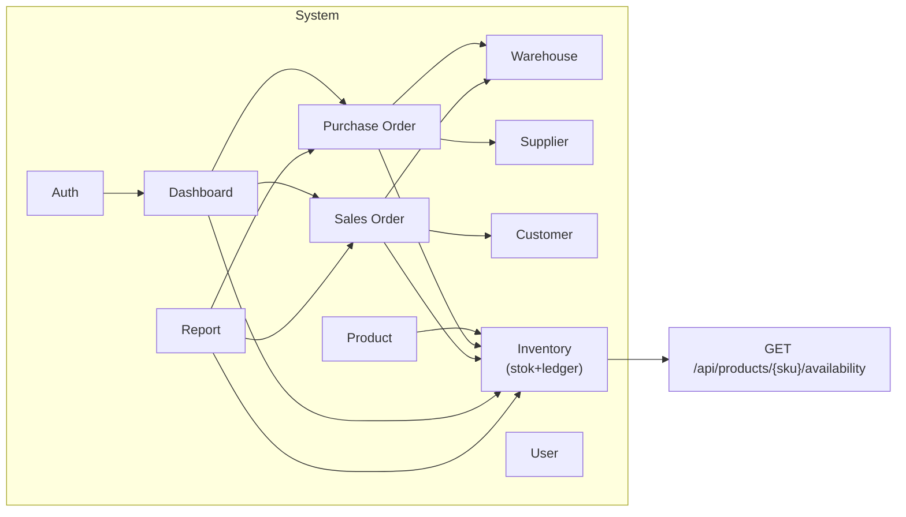

# Business Requirements Document: IOMS (Inventory & Order Management System)

**Lingkup**: Seluruh sistem
**Sumber**: Hasil reverse-engineering dari kodebase yang sudah ada oleh `/rudis.brd`
**Dibuat**: 2026-09-04
**Terakhir Diperbarui**: 2026-09-04
**Status**: Draft

## Ringkasan Eksekutif & Konteks Bisnis

IOMS adalah aplikasi web monolitik berbasis PHP 8.2 tanpa framework, untuk mengelola inventori multi-gudang dan alur order: master data (produk, kategori, supplier, customer, gudang, user), Purchase Order (supplier → stok masuk), Sales Order (customer → stok keluar, dengan gate approval), jejak audit stock ledger, dashboard berbasis role, laporan CSV, dan satu JSON API internal. Dibangun sebagai proyek asesmen/brief (`Project Brief - Programmer.pdf`) yang mendemonstrasikan arsitektur berlapis (Controller → Service → Repository) tanpa framework.

## Tujuan Bisnis

- **Visibilitas stok multi-gudang yang akurat**: melacak kuantitas per produk per gudang, menandai item di bawah reorder point.
- **Pengadaan terkontrol**: Purchase Order memasukkan stok lewat siklus Draft→Ordered→Received yang terawasi, dengan dukungan penerimaan parsial.
- **Fulfillment terkontrol dengan pemisahan peran**: Sales Order membutuhkan penyetuju yang bukan pembuatnya, dan approval khusus Admin, sebelum stok dikurangi.
- **Auditabilitas**: setiap perubahan stok (receipt, issue, adjustment) tercatat di `stock_ledger` lengkap dengan siapa/kapan/alasan.
- **Visibilitas sesuai peran**: Admin/Sales/WarehouseStaff masing-masing melihat dashboard dan izin akses yang disesuaikan dengan pekerjaannya.

## Stakeholder & Aktor Bisnis

| Aktor | Peran | Interaksi Utama |
| ----- | ---- | ---------------- |
| Admin | Akses penuh | Mengelola seluruh master data, user; satu-satunya yang bisa approve/reject Sales Order |
| Sales | Pembuat order | Membuat/submit Sales Order (tidak bisa approve, termasuk order miliknya sendiri) |
| WarehouseStaff | Fulfillment & penerimaan barang | Menerima barang PO, memenuhi (issue) Sales Order yang sudah disetujui |
| Cron (level OS) | Otomatis | Menjalankan `scripts/check-low-stock.php` di luar runtime aplikasi (tidak ada scheduler bawaan aplikasi) |
| Konsumen API (internal) | Sistem | Memanggil `GET /api/products/{sku}/availability` memakai autentikasi session yang sama dengan web UI |

## Daftar Modul

| Modul | Slug | Deskripsi | Peta |
| ------ | ---- | ------------ | --- |
| Auth | `auth` | Login/logout berbasis session, middleware pengecekan role | [modules/auth.md](modules/auth.md) |
| Product | `product` | Master data Produk & Kategori (CRUD, upload gambar) | [modules/product.md](modules/product.md) |
| Warehouse | `warehouse` | Master data gudang | [modules/warehouse.md](modules/warehouse.md) |
| Supplier | `supplier` | Master data supplier | [modules/supplier.md](modules/supplier.md) |
| Customer | `customer` | Master data customer | [modules/customer.md](modules/customer.md) |
| Inventory | `inventory` | Level stok per gudang, stock ledger, deteksi low-stock, API ketersediaan | [modules/inventory.md](modules/inventory.md) |
| Purchase Order | `purchase-order` | Siklus pemesanan ke supplier & penerimaan barang | [modules/purchase-order.md](modules/purchase-order.md) |
| Sales Order | `sales-order` | Pemesanan customer, alur approval, goods issue | [modules/sales-order.md](modules/sales-order.md) |
| User | `user` | Manajemen akun user (khusus Admin) | [modules/user.md](modules/user.md) |
| Dashboard | `dashboard` | Metrik ringkasan berbasis role | [modules/dashboard.md](modules/dashboard.md) |
| Report | `report` | Ekspor CSV stock ledger & status order | [modules/report.md](modules/report.md) |

Catatan: kodebase ini tidak memiliki struktur folder per-domain (semua controller berada flat di `app/Controller/`, dst.) — modul di atas adalah pengelompokan logis berdasarkan kapabilitas bisnis, satu klaster Controller+Service(+Entity) per modul, dipakai konsisten sebagai satuan untuk ID kapabilitas/entitas.

## Arsitektur Sistem

Monolit PHP 8.2 tunggal, tanpa framework: front-controller minimal (`public/index.php`) dengan `Router` custom, layering `Controller`→`Service`→`Repository`, view PHP server-rendered (tanpa framework client-side), persistensi PDO/MySQL 8, session native PHP untuk autentikasi. Dijalankan lewat Docker Compose (app + MySQL) untuk kebutuhan lokal/dev; tidak ada CI/CD, tidak ada queue, tidak ada microservices (secara eksplisit di luar lingkup, lihat Batasan).

## Inventaris Teknologi & Dependensi

| Dependensi | Versi (sesuai pin) | Catatan |
| ---------- | -------------------- | ---- |
| `php` | `>=8.2` | Tanpa framework; hanya autoload PSR-4 |
| `phpunit/phpunit` | `^10` (dev) | Suite Unit + Integration test |
| `phpstan/phpstan` | `^1` (dev) | Level 5, 0 error menurut README |
| `squizlabs/php_codesniffer` | `^3` (dev) | PSR-12 (`phpcs.xml`), 0 error / 32 warning kosmetik |
| MySQL | `8` | Schema di `database/schema.sql`, InnoDB, FK/CHECK constraint eksplisit |
| Docker / Docker Compose | n/a (kemudahan dev) | `Dockerfile` + `docker-compose.yml`, app + MySQL, khusus dev sesuai lingkup |

## Batasan & Catatan Non-Fungsional

- Seluruh endpoint/halaman tulis membutuhkan session terautentikasi (`App\Core\Auth`); pengecekan role diterapkan per-controller/service, bukan terpusat.
- Autentikasi API memakai ulang session cookie web — tidak ada token/JWT terpisah (keputusan lingkup eksplisit).
- Tidak ada rate limiting pada login maupun endpoint API.
- Concurrency-safety untuk pengurangan stok saat fulfillment SO memakai `SELECT ... FOR UPDATE` di dalam transaksi PDO (lihat [inventory.md](modules/inventory.md), ADR-002).
- Di luar lingkup sesuai brief: microservices, message queue, konfigurasi deployment cloud/K8s, pipeline CI/CD, WebSocket, aplikasi mobile, scheduler background dalam aplikasi, E2E test browser-automation (`docs/planning/scope.md`).
- Satu instance MySQL tunggal, tanpa replikasi/sharding; satu zona waktu server; gambar disimpan di filesystem lokal (`public/uploads`), bukan object storage.

## Di Luar Lingkup / Gap yang Diketahui

- `ApiController` membuat instance tiga `MySql*Repository` secara langsung, melewati layer Service yang dipakai di tempat lain (tercatat di `docs/quality/tech-debt.md` item 1).
- Tidak ada jejak audit untuk perubahan master data (Product/Category/Supplier/Customer/Warehouse) — hanya pergerakan stok yang tercatat di ledger.
- Tidak ada pipeline CI/CD; quality gate (`composer test`, `phpstan`, `phpcs`) dijalankan manual.
- Validasi lintas-field masih dangkal (hanya presence/format/uniqueness) — mis. tidak ada aturan yang mencegah harga jual SO lebih rendah dari harga beli produk.

## Glosarium

- **PO / SO**: Purchase Order / Sales Order.
- **Goods Receipt**: pencatatan kuantitas barang yang dikirim supplier terhadap sebuah PO, parsial atau penuh, menambah `product_stocks` dan menulis entri Receipt di `stock_ledger`.
- **Goods Issue**: pengurangan `product_stocks` saat Sales Order dipenuhi, menulis entri Issue di `stock_ledger`.
- **Reorder point**: ambang batas per produk; total stok di semua gudang di bawah ambang ini menandai produk sebagai low-stock.
- **Stock Ledger**: tabel audit append-only untuk setiap pergerakan stok (Receipt/Issue/Adjustment).

## Asumsi & Pertanyaan Terbuka

- Modul dikelompokkan berdasarkan kapabilitas bisnis, bukan berdasarkan folder kode sumber, karena kodebase tidak memiliki struktur folder per-domain — dikonfirmasi wajar mengingat tata letak berlapis yang flat pada aplikasi ini (lihat catatan di Arsitektur Sistem).
- Approval SO satu tingkat (khusus Admin, pembuat ≠ penyetuju) adalah asumsi terdokumentasi di `docs/planning/scope.md`, bukan pertanyaan terbuka.

## Change Log

- **2026-09-04**: Versi awal dibuat dari hasil survei kodebase (11 modul), dalam Bahasa Indonesia.
