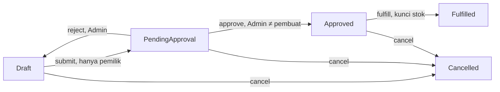

# Modul: Sales Order (`sales-order`)

**Kembali ke**: [00-overview.md](../00-overview.md) · **Terakhir Diperbarui**: 2026-09-04

## Ringkasan

Mengelola siklus penjualan ke customer dari draft, melewati gate approval Admin, hingga fulfillment, mengurangi stok gudang dengan locking yang aman terhadap concurrency.

## Kapabilitas

- **SO-CAP-001** — buat draft SO dengan customer, gudang, tanggal order, item (produk + qty + harga jual)
- **SO-CAP-002** — submit untuk approval (hanya pemilik order, Draft → PendingApproval)
- **SO-CAP-003** — approve (hanya Admin, tidak bisa approve order miliknya sendiri, PendingApproval → Approved)
- **SO-CAP-004** — reject (hanya Admin, PendingApproval → Draft)
- **SO-CAP-005** — fulfill / goods issue (Approved → Fulfilled), pengurangan stok yang aman terhadap race condition
- **SO-CAP-006** — batalkan (status non-final apa pun kecuali Fulfilled)
- **SO-CAP-007** — list/lihat SO

## Entitas & Aturan Kunci

- **SO-ENT-001 SalesOrder** — `soNumber` (unik), `customerId`, `warehouseId`, `createdBy`, `approvedBy`, `status` (Draft/PendingApproval/Approved/Fulfilled/Cancelled), `orderDate` (`app/Entity/SalesOrder.php`, tabel `sales_orders`)
- **SO-ENT-002 SalesOrderItem** — `salesOrderId`, `productId`, `qty`, `sellingPrice` (`app/Entity/SalesOrderItem.php`, tabel `sales_order_items`)
- Invariant pemisahan peran (`app/Service/SalesOrderService.php`): yang submit harus pembuat order; yang approve/reject harus role `Admin`; penyetuju tidak boleh sama dengan pembuat — pelanggaran melempar `AuthorizationException` (dirender sebagai HTTP 403, bukan redirect)
- Transisi status diterapkan di `SalesOrderService::assertTransition`; hanya satu tingkat approval (asumsi terdokumentasi, tidak ada chain approval multi-tingkat)

## API Surface

**Expose**:

| Jenis | Nama / Route | Role | File Utama |
| ---- | ------------ | ---- | ---------- |
| HTTP | `GET/POST /sales-orders*`, `GET /sales-orders/{id}` | Terautentikasi | [`app/Controller/SalesOrderController.php`](../../app/Controller/SalesOrderController.php) |
| HTTP | `POST /sales-orders/{id}/submit` | Pemilik order (Sales) | sama |
| HTTP | `POST /sales-orders/{id}/approve`, `/reject` | Hanya Admin | sama |
| HTTP | `POST /sales-orders/{id}/fulfill` | Umumnya WarehouseStaff | sama |
| HTTP | `POST /sales-orders/{id}/cancel` | Terautentikasi | sama |

**Konsumsi**:

- Modul `customer`, `warehouse`, `product` — data referensi
- Modul `inventory` — `ProductStockRepositoryInterface::lockForUpdate`/`decrement` dan `StockLedgerRepositoryInterface::record` (entri Issue) saat fulfillment

## Alur Data

- Create: user submit SO + item → `SalesOrderService::create` memvalidasi (keunikan nomor SO, customer/gudang/tanggal wajib, ≥1 item dengan qty positif) → tersimpan sebagai Draft.
- Fulfill (satu transaksi PDO, ADR-002): untuk setiap item → `lockForUpdate` pada baris `product_stocks` → jika ada item dengan qty tersedia < qty yang diminta, lempar `InsufficientStockException` dan rollback semuanya → jika tidak, kurangi stok semua item, tulis entri Issue di `stock_ledger`, set status Fulfilled, commit.

## Screens/Pages

| Screen | Route | File Utama | Kapabilitas Terkait |
| ------ | ----- | ---------- | ------------------ |
| List SO | `/sales-orders` | [`views/sales_order/index.php`](../../views/sales_order/index.php) | SO-CAP-007 |
| Detail SO (aksi approve/reject/fulfill/cancel) | `/sales-orders/{id}` | [`views/sales_order/show.php`](../../views/sales_order/show.php) | SO-CAP-002..006 |
| Create SO | `/sales-orders/create` | [`views/sales_order/create.php`](../../views/sales_order/create.php) | SO-CAP-001 |

## Dependensi

- **Modul lain**: `customer`, `warehouse`, `product`, `inventory`
- **Eksternal**: transaksi PDO + row locking (`SELECT ... FOR UPDATE`)

## Cakupan Test

- `tests/Unit/SalesOrderServiceTest.php` — mencakup create/submit/approve/reject/aturan otorisasi (in-memory)
- `tests/Integration/GoodsIssueIntegrationTest.php` — mencakup race condition fulfillment konkuren terhadap MySQL nyata

## Gap / Risiko yang Diketahui

- Tidak ada format nomor SO otomatis — input manual, hanya keunikan yang divalidasi (asumsi terdokumentasi).
- Tidak ada validasi lintas-field yang mencegah `selling_price` lebih rendah dari `purchase_price` produk.

## Change Log

- **2026-09-04**: Versi awal dibuat dari hasil survei kodebase.
