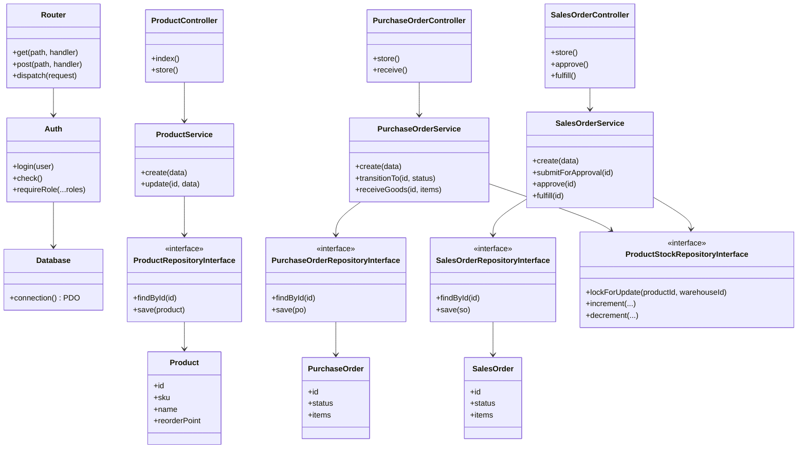

# Class Diagram — Draft Awal (Sebelum Coding)

Diagram ini adalah rencana desain awal sebelum implementasi dimulai. Versi ini disederhanakan dibanding hasil akhir (lihat `docs/architecture/class-diagram-as-built.md` untuk versi nyata) — belum memasukkan seluruh Exception domain maupun implementasi In-Memory untuk testing.

## Rencana awal (ringkas)

- Layering: Controller → Service → Repository Interface → implementasi konkret (rencana awal hanya berasumsi 1 implementasi MySQL, belum direncanakan implementasi In-Memory untuk unit test).
- Setiap entitas transaksi (PO/SO) direncanakan punya Service sendiri yang menangani validasi + transisi status.
- Belum ada rencana eksplisit untuk kelas Exception domain terpisah (awalnya diasumsikan validasi cukup dengan array error biasa).
- Stok direncanakan memakai locking, namun mekanisme detail (SELECT FOR UPDATE vs alternatif lain) baru diputuskan saat desain arsitektur — lihat ADR-002.
