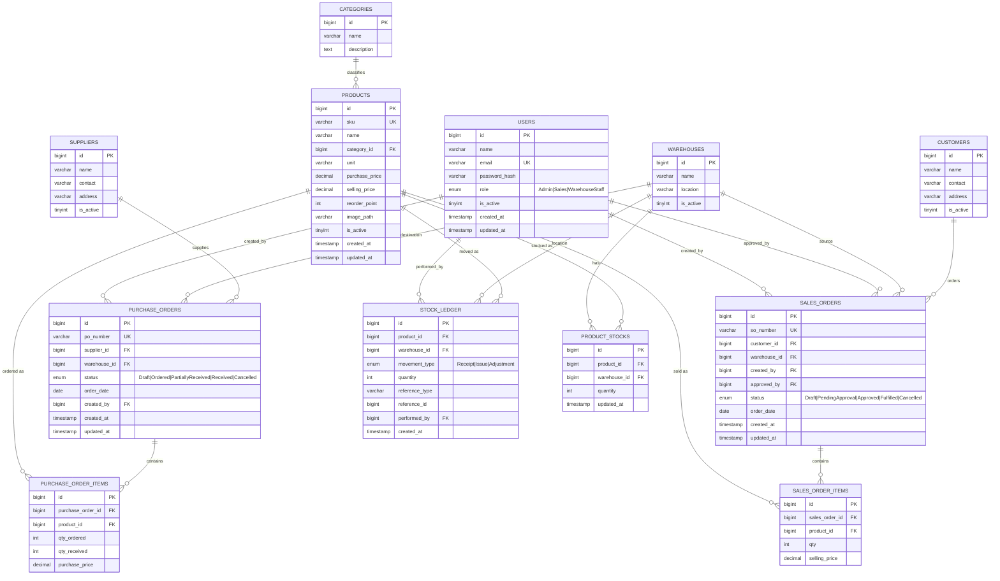

# Entity Relationship Diagram (ERD)

Dibuat berdasarkan `database/schema.sql` asli (12 tabel/entitas).

## Catatan

- `product_stocks` memiliki `UNIQUE KEY (product_id, warehouse_id)` — satu baris per kombinasi produk-gudang, dengan `CHECK (quantity >= 0)`.
- `stock_ledger.reference_type`/`reference_id` adalah polymorphic reference (bukan FK sungguhan) yang menunjuk ke `purchase_orders` atau `sales_orders` tergantung `movement_type` (`Receipt` → PO, `Issue` → SO).
- `sales_orders.approved_by` nullable (`ON DELETE SET NULL`), hanya terisi setelah status `Approved`.
- Semua kolom status memakai `ENUM` MySQL native sesuai daftar status di masing-masing Service (`PurchaseOrderService::TRANSITIONS`, `SalesOrderService::TRANSITIONS`).
