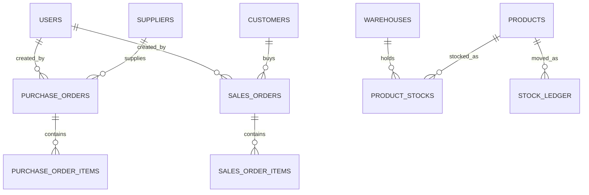
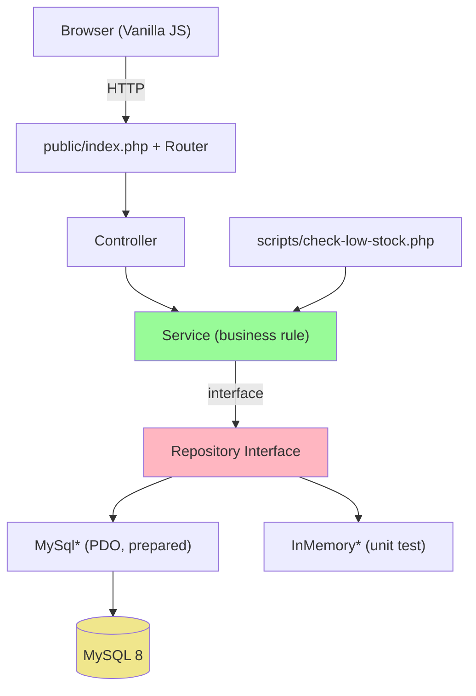
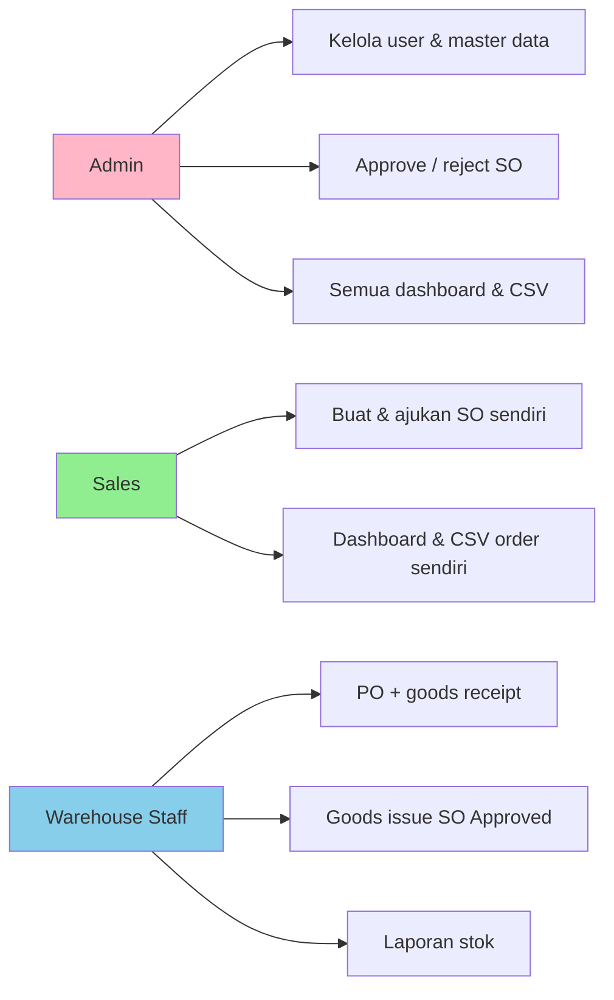

# Implementation Plan: Kepatuhan IOMS terhadap Project Brief

**Branch**: `001-ioms-brief-compliance` (tidak dibuat; `RUDIS_FEATURE` dipakai, tetap di `master`) | **Date**: 2026-10-06 | **Spec**: [spec.md](spec.md)
**Input**: Feature specification from `/specs/001-ioms-brief-compliance/spec.md`

## Summary

IOMS sudah memenuhi hampir seluruh requirement brief (316 test lulus, coverage 100%, PHPStan 0
error). Rencana ini tidak menambah modul; ia (1) menyinkronkan dokumen bukti dengan kode terbaru,
(2) memverifikasi ulang item yang berubah (UI-01, Docker bersih, SonarQube), dan (3) menutup higiene
proses (konfigurasi keamanan, AI disclosure, tag final) sebelum technical defense 2026-10-07.
Pendekatan teknis: ubah dokumen dan konfigurasi saja; kode hanya disentuh bila verifikasi
menemukan defect.

## Technical Context

**Language/Version**: PHP 8.2+ native (image `php:8.2-apache`; host dev PHP 8.4)
**Primary Dependencies**: tanpa dependency runtime; Composer hanya autoload. Dev: PHPUnit, PHPStan 1.12 (level 5), PHP_CodeSniffer (PSR-12), phpcov
**Storage**: MySQL 8.0 (PDO prepared statement, transaksi eksplisit)
**Testing**: PHPUnit `Unit` (157), `Integration` (9, MySQL nyata), `E2E` (117) over HTTP; coverage gabungan via `scripts/coverage.sh`
**Target Platform**: Docker Compose (service `app` Apache + `mysql`); SonarQube lokal di compose terpisah
**Project Type**: web (server-rendered, satu aplikasi)
**Architecture Type**: monolith standalone berlapis Controller -> Service -> Repository; ditentukan dari `docs/architecture/` dan struktur repo
**Integration Target**: N/A (satu JSON API internal `GET /api/products/{sku}/availability`)
**Existing Design System**: CSS buatan sendiri dengan design token di `public/assets/css/style.css` (`:root` variabel warna, spacing, radius, shadow); ikon lucide lokal di `public/assets/icons/`; tidak ada library UI
**Performance Goals**: tidak ada target khusus; CSV dibuat sinkron (batas 100.000 baris, tercatat di tech-debt)
**Constraints**: tanpa framework/ORM/DI container, Vanilla JS, tanpa library JS/CSS; out of scope: CI/CD, queue, microservices
**Scale/Scope**: 3 role, 2+ gudang, seed 32 produk dan 25 order (13 PO + 12 SO)

## UI/UX & Screens (carried from spec)

- **Design reference**: tampilan IOMS yang ada (token CSS sendiri).
- **Screens**: Dashboard Admin/Sales/Warehouse, Detail Sales Order, Reports. State: empty (Recent Sales Orders), populated (kartu), konfirmasi aksi destruktif.
- **Primary interactions/flows**: dialog konfirmasi in-page (`<dialog>`), alert selalu di atas judul, validasi live yang menghapus error saat field valid.

## Constitution Check

*GATE: Must pass before Phase 0 research. Re-check after Phase 1 design.*

| Prinsip (constitution v1.0.0) | Status | Catatan |
| ----------------------------- | ------ | ------- |
| I. PHP native berlapis + DIP | PASS | `ArchitectureTest` menjaga Service bebas PDO/session; interface repository punya implementasi MySQL dan in-memory |
| II. Integritas stok & transaksi | PASS | `FOR UPDATE` + satu transaksi (ADR-002, ADR-005); soft delete produk/supplier/customer |
| III. Otorisasi server & SoD | PASS | `Auth::requireRole`, 403 sungguhan, Sales tidak bisa approve |
| IV. Keamanan minimum | PASS | `permissions.deny` Claude Code sengaja dikosongkan pemilik (D7 di `docs/planning/decisions.md`); itu alat bantu dev, bukan kode aplikasi, dan `.env` tetap tidak ter-track |
| V. Test terisolasi + static analysis | PASS | 316 test, coverage 100%, PHPStan 0, PHPCS 0 error |
| Frontend/API/UX | PASS | Vanilla JS, `<dialog>` native, JSON API 200/401/404; UI-01 diverifikasi ulang di Phase 2 |
| Environment, data, delivery | WATCH | dokumen as-built dan angka test tertinggal; tag final belum diperbarui |

Tidak ada pelanggaran yang membutuhkan pembenaran. Satu WATCH (dokumen dan tag final) menjadi task.

**Re-check pasca desain (Phase 1)**: tetap PASS; artefak Phase 1 hanya dokumen dan tidak mengubah arsitektur.

## Project Structure

### Documentation (this feature)

```text
specs/001-ioms-brief-compliance/
├── plan.md              # This file (/rudis.plan command output)
├── research.md          # Phase 0 output
├── data-model.md        # Phase 1 output
├── quickstart.md        # Phase 1 output
├── contracts/           # Phase 1 output (api-availability.md)
└── tasks.md             # Phase 2 output (/rudis.tasks command)
```

### Source Code (repository root)

```text
app/
├── Controller/   # HTTP/routing: Auth, Dashboard, Product, PurchaseOrder, SalesOrder, Report, Api, CRUD master
├── Service/      # business rule: *Service, OrderItemValidator, DateRules, LoginThrottle, Exception/
├── Repository/   # *RepositoryInterface + MySql* + InMemory* (+ MySqlReportRepository)
├── Entity/       # model domain
└── Core/         # Router, Auth, Session, View, Database, Env, Response
views/            # template + partials (confirm dialog dipanggil dari footer)
public/           # entry point, assets (css, js, icons)
config/  database/ (schema.sql, seed.sql)  scripts/ (check-low-stock, coverage, reset-db)
tests/Unit  tests/Integration  tests/E2E
docs/planning  docs/architecture  docs/quality  docs/testing  docs/brd  docs/report
.rudis/  specs/
```

**Structure Decision**: struktur brief §4.1 sudah diikuti persis; fitur ini hanya menyentuh `docs/`,
`README.md`, `ai-usage-log.md`, `.claude/settings.json`, dan `specs/`.

## Complexity Tracking

Tidak ada pelanggaran constitution. Dua keputusan yang melampaui minimum brief dicatat jujur:

| Tambahan | Why Needed | Simpler Alternative Rejected Because |
| -------- | ---------- | ------------------------------------ |
| `ReportRepositoryInterface` + `MySqlReportRepository` | CSV perlu nama dan nomor order (JOIN) alih-alih ID mentah | Memakai repository yang ada memaksa N+1 query atau kolom ID yang tidak informatif |
| Suite E2E over HTTP | Menutup coverage view/controller dan bukti alur nyata | Brief tidak mewajibkannya, tetapi tanpa itu coverage 100% tidak tercapai; ADR-003 mencatat alasannya |

---

## Technical Diagrams

### Data Design Decisions

Skema mengikuti brief §1.3 satu tabel per entitas; tidak ada deviasi merge/flatten. Satu-satunya
perubahan baru adalah urutan kolom `sales_orders` (tanpa perubahan struktur).

| Source resource / sub-resource | Table(s) | Mapping | Rationale |
| ------------------------------ | -------- | ------- | --------- |
| User, Warehouse, Category, Product, Supplier, Customer | `users`, `warehouses`, `categories`, `products`, `suppliers`, `customers` | mirror | 1:1 dengan entitas brief; soft delete lewat `is_active` |
| ProductStock | `product_stocks` (UNIQUE product+warehouse, CHECK quantity >= 0) | mirror | satu baris per kombinasi produk-gudang |
| PurchaseOrder + Item | `purchase_orders`, `purchase_order_items` | mirror (child) | item adalah sub-resource |
| SalesOrder + Item | `sales_orders`, `sales_order_items` | mirror (child) | urutan kolom `sales_orders` kini sejajar dengan `purchase_orders` |
| StockLedger | `stock_ledger` (reference_type/id polimorfik) | mirror | tipe Receipt/Issue/Adjustment |

### Data Model (Entity Relationship Diagram)



ERD lengkap: `docs/planning/erd.md`.

### System Architecture



### Use Case Diagram


