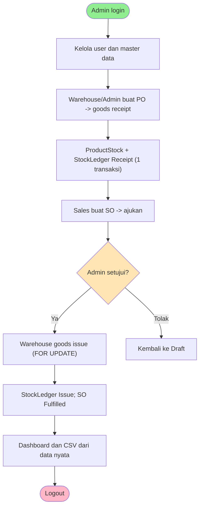
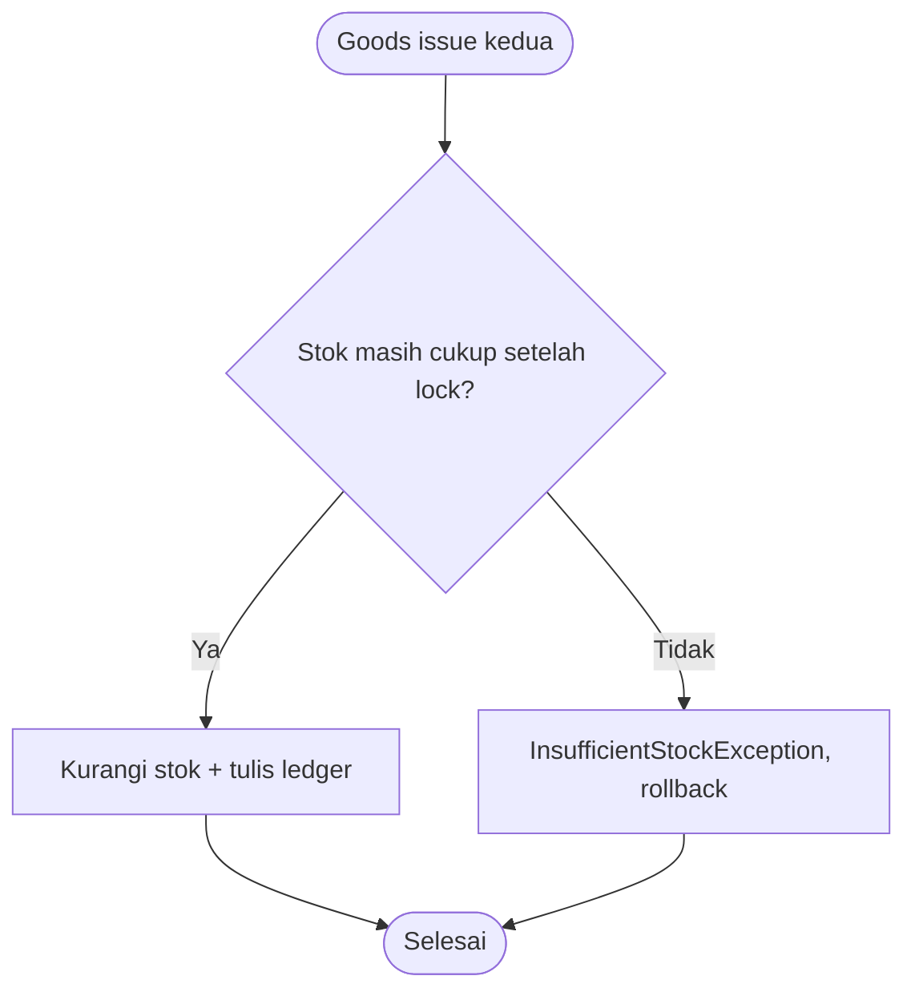

# Feature Specification: Kepatuhan IOMS terhadap Project Brief

**Feature Branch**: `001-ioms-brief-compliance` (tidak dibuat; tetap di `master`)
**Created**: 2026-10-06
**Status**: Draft
**Input**: User description: "Sesuaikan implementasi Rudis dengan Project Brief - Programmer: peta requirement AUTH/USR/PRD/WH/PO/SO/VIEW/FIND/DASH/REPORT/API/VAL/ERR/UI/DB/JOB/ARCH/DESIGN/TEST ke status implementasi"

Sumber otoritatif: `docs/report/Project Brief - Programmer.pdf` (Edisi 1.0, identik dengan berkas di
`~/Downloads/test/general/`). Constitution proyek: `.rudis/memory/constitution.md` v1.0.0.

Aplikasi IOMS sudah dibangun. Fitur ini tidak menambah modul baru: ia menetapkan **baseline kepatuhan**
terhadap brief, mencatat bukti per requirement, dan menutup selisih yang tersisa (terutama dokumen
yang tertinggal dari kode, verifikasi ulang, dan kesiapan technical defense 2026-10-07).

## User Scenarios & Testing *(mandatory)*

### User Story 1 - Assessor menelusuri requirement ke bukti (Priority: P1)

Assessor membuka satu ID requirement brief (mis. SO-01, ARCH-02) dan harus menemukan kode, test,
serta dokumen yang membuktikannya tanpa bantuan peserta.

**Why this priority**: Brief menilai bukti, bukan klaim; requirement tanpa bukti yang dapat ditelusuri
dianggap tidak terpenuhi, dan beberapa kegagalan bersifat critical (§8.2).

**Independent Test**: Ambil 5 ID acak dari tabel keterlacakan (FR-001..FR-0xx); tiap ID harus
menunjuk ke berkas yang ada dan test yang lulus.

**Acceptance Scenarios**:

1. **Given** tabel keterlacakan, **When** assessor memilih ID requirement, **Then** kolom bukti
   menunjuk ke kode, test, dan dokumen yang benar-benar ada di repo.
2. **Given** seluruh test dijalankan lewat satu perintah, **When** selesai, **Then** semua lulus dan
   angka pada dokumen sama dengan hasil run terbaru.

---

### User Story 2 - Dokumen sesuai kode aktual (Priority: P1)

Class diagram as-built, ERD, README, laporan test, dan laporan SonarQube MUST mencerminkan kode saat
ini; diagram yang tidak sesuai kode adalah critical failure (§8.2).

**Why this priority**: Perubahan terbaru (laporan CSV via `ReportRepository`, `rupiah()`, dashboard per
role, dialog konfirmasi, urutan kolom `sales_orders`, script reset DB) belum tercermin di dokumen.

**Independent Test**: Telusuri 3 kelas dari class diagram as-built ke kode, dan bandingkan angka test
dan coverage di dokumen dengan output `composer coverage`.

**Acceptance Scenarios**:

1. **Given** `ReportRepositoryInterface`/`MySqlReportRepository` ada di kode, **When** membuka
   `docs/architecture/class-diagram-as-built.md`, **Then** keduanya tampil dengan dependency ke
   interface ditandai.
2. **Given** run coverage terbaru (316 test, coverage 100%), **When** membaca README dan
   `docs/testing/`, **Then** angkanya sama.

---

### User Story 3 - Kesiapan demo dan technical defense (Priority: P2)

Peserta dapat menjalankan Docker dari kondisi bersih, memperlihatkan alur PO -> SO -> ledger, tiga
dashboard, CSV, endpoint JSON, test hijau, skenario oversell, dan menjelaskan satu ADR dan satu
refactor.

**Why this priority**: §8.1 mendefinisikan demo dan defense; kegagalan Docker adalah critical
failure.

**Independent Test**: Clone bersih -> `docker compose up --build` -> login tiga role -> jalankan
`composer test` -> jalankan `docker compose exec app php scripts/check-low-stock.php`.

**Acceptance Scenarios**:

1. **Given** folder bersih, **When** menjalankan prosedur README, **Then** login tiga role berhasil
   dan seed memuat >= 30 produk dan >= 25 order.
2. **Given** dua goods issue untuk produk dan gudang yang sama, **When** stok hanya cukup untuk satu,
   **Then** yang kedua ditolak dan stok tidak negatif.

---

### User Story 4 - Higiene konfigurasi dan proses (Priority: P3)

Konfigurasi proyek tidak melemahkan keamanan (daftar `permissions.deny` di `.claude/settings.json`
sebelumnya melarang `rm -rf`, `git push --force`, dan membaca `.env`/kunci), dan penggunaan AI
tercatat lengkap.

**Why this priority**: Brief mewajibkan disclosure AI dan melarang secret masuk repo (§6, §8.2).

**Independent Test**: `git diff` pada `.claude/settings.json` bersih atau perubahannya disengaja;
`ai-usage-log.md` memuat sesi ini.

**Acceptance Scenarios**:

1. **Given** `.claude/settings.json`, **When** diperiksa, **Then** daftar deny dipulihkan atau ada
   catatan keputusan mengapa dikosongkan.

---

### Edge Cases

- Angka di dokumen (jumlah test, assertion, coverage) basi setelah kode berubah: setiap angka harus
  bersumber dari run terbaru, bukan disalin dari run lama.
- Requirement brief yang ambigu (mis. peran "Boleh mengusulkan" PO untuk Warehouse Staff, brief §1.2)
  harus dicatat sebagai keputusan di `docs/planning/`, bukan diubah diam-diam (FAQ #12).
- Scan SonarQube butuh `SONAR_TOKEN`; tanpa itu hasil Sonar tidak dapat diverifikasi.
- Port 9000 bentrok dengan php-fpm lokal; SonarQube bergantung pada php-fpm Homebrew tetap mati.

## Requirements *(mandatory)*

### Functional Requirements

Status: **Done** = ada kode + test lulus + dokumen; **Perlu sinkron** = fungsi ada, dokumen/bukti
tertinggal; **Verifikasi** = perlu dijalankan ulang sebelum defense.

| ID | Requirement brief | Status | Bukti utama |
| -- | ----------------- | ------ | ----------- |
| FR-001 | AUTH-01 login, session, hash password | Done | `AuthService`, `Auth`, E2E `AuthE2ETest` |
| FR-002 | AUTH-02 logout | Done | `AuthController`, E2E |
| FR-003 | USR-01 manajemen user 3 role | Done | `UserService`, `CrudResourcesE2ETest` |
| FR-004 | PRD-01 produk, kategori, reorder point, upload | Done | `ProductService`, `ProductE2ETest` |
| FR-005 | WH-01 gudang & stok multi-lokasi | Done | `WarehouseService`, `product/show` |
| FR-006 | PO-01 PO + goods receipt (parsial) | Done | `PurchaseOrderService`, `GoodsReceiptIntegrationTest` |
| FR-007 | SO-01 SO, approval, goods issue | Done | `SalesOrderService`, `GoodsIssueIntegrationTest` |
| FR-008 | VIEW-01 daftar, detail, empty state | Done | `views/*`, E2E empty state |
| FR-009 | FIND-01 search/filter/sort/pagination, seed >= 30 produk & 25 order | Done | 32 produk, 25 order di seed (13 PO + 12 SO) |
| FR-010 | DASH-01 dashboard per role dari agregasi | Done | `DashboardService`; `docs/brd/modules/dashboard.md` diperbarui; E2E `BriefRequirementsE2ETest` (tiga role, nilai dari SQL pembanding) |
| FR-011 | REPORT-01 CSV ledger & status order | Done | `ReportService` + `MySqlReportRepository`; `docs/brd/modules/report.md` diperbarui; `ReportServiceTest` dan E2E laporan |
| FR-012 | API-01 JSON endpoint | Done | `GET /api/products/{sku}/availability`, `ApiController` |
| FR-013 | VAL-01 validasi FE+BE | Done | `validation.js` (live clear error), `OrderItemValidator` |
| FR-014 | ERR-01 401/403/404 tanpa stack trace | Done | `Auth`, `views/errors`, E2E |
| FR-015 | UI-01 responsif 360px, label, focus | Done | `docs/testing/screenshots/` (20 berkas, 360px dan desktop), TS-48; tabel dashboard diperbaiki agar muat di 360px |
| FR-016 | DB-01 schema, constraint, index, PDO, transaksi | Done | `schema.sql` dan `docs/planning/erd.md` sinkron (urutan kolom `sales_orders`) |
| FR-017 | JOB-01 script terjadwal | Done | `scripts/check-low-stock.php` (dijalankan via `docker compose exec`) |
| FR-018 | ARCH-01 layer + interface + 2 implementasi | Done | `*RepositoryInterface`, `MySql*`/`InMemory*`, `ArchitectureTest` |
| FR-019 | ARCH-02 stok aman konkurensi | Done | `FOR UPDATE` di `MySqlProductStockRepository`, ADR-002 |
| FR-020 | DESIGN-01 class diagram initial & as-built | Done | `class-diagram-as-built.md` memuat `ReportRepository`, `totalRetailValue()`, dan catatan perubahan 14-16 |
| FR-021 | DESIGN-02 ADR (2-3) | Done | `docs/architecture/adr-001..005` |
| FR-022 | DESIGN-03 refactor log, audit SRP, tech-debt | Done | `refactor-log.md` kini 9 entri (entri 8-9 baru); commit `refactor:` ada di history |
| FR-023 | DESIGN-04 critique | Done | `docs/quality/critique.md` |
| FR-024 | TEST-01/02/03 unit, integration, static analysis, FIRST | Done | 316 test lulus, coverage 100%, PHPStan 0 error, PHPCS 0 error; README, `docs/testing/`, dan laporan Sonar sinkron |
| FR-025 | §6.2 AI disclosure | Done | `ai-usage-log.md` diperbarui 2026-10-06 (termasuk kesalahan AI yang ditemukan dan diperbaiki) |
| FR-026 | §4.2 / §8.2 keamanan konfigurasi | Done (keputusan pemilik) | `.claude/settings.json`: daftar `permissions.deny` sengaja dikosongkan agar Claude dapat membaca `.env`; dicatat sebagai D7 di `docs/planning/decisions.md`; `.env` tetap tidak ter-track |
| FR-027 | §5 Docker bersih + §10 checklist, tag final | Done | Docker bersih lulus (`docs/testing/docker-clean-run.md`); checklist `docs/quality/submission-checklist.md`; tag tunggal `v1.0.0` (dipasang pemilik pada commit akhir) |

- **FR-028**: Sistem dokumentasi MUST memuat satu sumber angka test/coverage yang sama di README, `docs/testing/`, dan `docs/quality/sonarqube-report.md`.
- **FR-029**: Keputusan atas requirement ambigu MUST dicatat di `docs/planning/` (brief FAQ #12).

### Non-Functional Requirements

- **NFR-001**: Seluruh test (Unit + Integration + E2E) lulus dan line coverage 100% pada run terbaru.
- **NFR-002**: PHPStan level 5 nol error; PHPCS PSR-12 nol error (warning panjang baris dijelaskan).
- **NFR-003**: SonarQube: quality gate Passed, 0 isu terbuka, 0 hotspot, duplikasi 0%.
- **NFR-004**: Tidak ada secret/credential di repo atau history; `.env` tidak ter-track.
- **NFR-005**: Aplikasi dan DB naik dari kondisi bersih dengan `docker compose up --build`.

### Key Entities

Tidak ada entitas baru. Entitas relevan (brief §1.3): User, Warehouse, Category, Product,
ProductStock, Supplier, Customer, PurchaseOrder(+Item), SalesOrder(+Item), StockLedger.

- **SalesOrder**: state lifecycle Draft -> PendingApproval -> Approved -> Fulfilled, atau Cancelled
  sebelum Fulfilled; urutan kolom tabel kini sejajar dengan `purchase_orders`.
- **StockLedger**: tipe Receipt/Issue/Adjustment; referensi `purchase_order`/`sales_order`.

## Success Criteria *(mandatory)*

### Measurable Outcomes

- **SC-001**: 100% ID requirement brief (AUTH-01 s.d. JOB-01, ARCH-01/02, DESIGN-01..04, TEST-01..03) punya baris bukti yang dapat ditelusuri.
- **SC-002**: Nol angka basi: jumlah test/coverage di dokumen sama dengan output `composer coverage` terbaru.
- **SC-003**: Class diagram as-built dapat ditelusuri ke kode untuk setiap kelas yang disebut (sampel 5 kelas).
- **SC-004**: Dari clone bersih, `docker compose up --build` hingga login tiga role selesai tanpa langkah di luar README.
- **SC-005**: Checklist §10 brief: 12 dari 12 item bertanda terpenuhi atau keterbatasannya tercatat.

## UI/UX & Screens *(mandatory when the feature has a user interface)*

Fitur ini tidak menambah layar. Layar yang diverifikasi ulang terhadap UI-01 (360px dan desktop):

### Design Reference

- **Design source**: none; mengikuti tampilan IOMS yang ada (CSS buatan sendiri, ikon lucide lokal).
- **Existing UI to match**: seluruh halaman IOMS saat ini.

### Screen Inventory

| Screen | Purpose | Serves story | Key data shown | Primary actions |
| ------ | ------- | ------------ | -------------- | --------------- |
| Dashboard Admin | Ringkasan keuangan dan tindakan | US3 | Inventory Value, Potential Revenue/Margin, Low Stock, SO Pending, PO Awaiting Receipt | buka daftar terkait |
| Dashboard Sales | Ringkasan order milik sendiri | US3 | 5 kartu status, Recent Sales Orders | buka detail order |
| Dashboard Warehouse | Antrean receipt/issue | US3 | 4 kartu antrean, Low Stock Items | buka PO/SO |
| Detail Sales Order | Approve/Reject/Fulfill/Cancel | US3 | item, total Rupiah, alert di atas judul | aksi dengan dialog konfirmasi |
| Reports | Unduh CSV per role | US3 | Stock Ledger, PO, SO | Download CSV |

### Per-Screen Key States

- **Dashboard Sales**: empty = "No sales orders yet" dengan tombol New Sales Order pada Recent Sales Orders; populated = 5 kartu dan tabel.
- **Dialog konfirmasi**: fokus awal pada "Go back"; Esc dan klik backdrop membatalkan; tombol aksi merah untuk aksi destruktif.

### Primary Interactions & Flows

- Aksi destruktif (Reject, Cancel, Deactivate, Fulfill) meminta konfirmasi lewat dialog in-page.
- Alert (flash dan notice) selalu tampil di atas judul halaman.

## Business Process Flow *(visual aid)*

### Primary User Journey Flow

### Alternative/Secondary Flows

## Business Actors & Interactions

| Actor | Role | Key Interactions |
| ----- | ---- | ---------------- |
| Admin | Pengelola penuh | Kelola user/master data, approve/reject SO, PO, semua laporan |
| Sales | Penjual | Buat dan ajukan SO miliknya, dashboard dan CSV miliknya |
| Warehouse Staff | Gudang | Usulkan/buat PO, goods receipt, goods issue, laporan stok |
| Assessor | Penilai | Menelusuri requirement ke bukti, menjalankan Docker dan test, defense |
| System | Aplikasi | Menulis StockLedger dalam satu transaksi, menolak oversell, menegakkan otorisasi di server |
